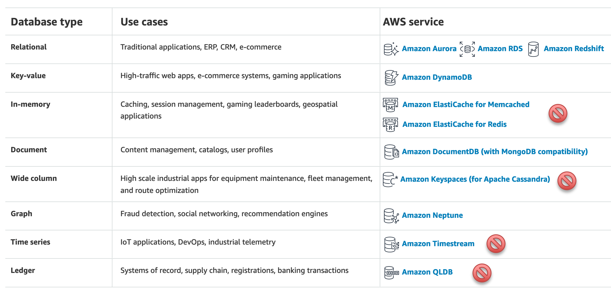

# Project Database 

We will provide and set up a PostgreSQL (9.2.24) database for your team to use, please contact your project TA. You can chose your own [database]() other than PostgreSQL but you need to make sure that we can see your work. If you chose your own database, you need to provide a detail document about how to setup that database and import your data. 

## Important
* Backup your data and write a script so your database can be restore quickly. Things happened!!! 

## CS4604 PostgreSQL database (By Request)
* Host: cs4604.cs.vt.edu
* Database: postgres
* Username:

    If your team's name is cs4604-TeamName then your username is teamname
* Password: ask your Project TA
* Schema:

    If your team's name is cs4604-TeamName then your schema is cs4604_teamname

## Database list
You can select you own database from below list. You need to provide a detail installation, usage, etc document if you do this.



## FAQ

1. What is PostgreSQL? Why are we using it and not MySQL, Oracle, Microsoft SQL server ...?

    PostgreSQL is an advanced open-source RDBMS, increasingly used by a large number of high profile projects. We use it in CS 4604 because:

    * it is open-source and free ("free as in speech, not as in beer") software;
    * it is not really important which RDBMS you use to learn SQL;
    * among open-source RDBMS, PostgreSQL has some advantages over MySQL (e.g., MySQL does not enforce CHECK constraints).

    [Extensive documentation](https://www.postgresql.org/docs/9.2/index.html) is available for PostgreSQL, which you should make for your leisure reading. The documentation is also available with user comments.

2. Can I install PostgreSQL on my own computer?

    Yes! You are welcome to install it on your own computer. Install version 9.2.24 or later. PostgreSQL works on Linux ,Mac OS X, and Windows. You can download versions for these operating systems. We won't be able to provide tech-support for the installation though. If you decide to do this, you can read this [link](https://www.postgresql.org/docs/9.2/app-pgdump.html) to learn how to download the data from our database server. Download it to your account on cs4604.cs.vt.edu. You can then transfer the data to your machine and re-load into your database.

3. CS 4604 PostgreSQL server

    The database server cs4604.cs.vt.edu is provided by the department. The server specification is 4 cores and 8 GB memory. Hence if multiple students run big queries at the same time, the server may slow down and not be as responsive. Although we have optimized the server, note the following things:
    * First, always test your queries on smaller toy sample tables, before running it on the large tables. Also desist from designing queries with extremely large joins (sometimes this can not be helped, but pay attention if you are designing an unnecessarily slow query).
    * If you run a query and the system does not respond for a long time (more than 5 minutes), you show kill this query by using the following query in your private database:
    1. Check all the processes that are running:
    ```sql
    SELECT * FROM pg_stat_activity WHERE state = 'active';
    ```
    2. Identify the PID of the hanging query you want to terminate:
    ```sql
    SELECT pg_cancel_backend(PID);
    ```
    3. This query might take a while to kill the query, so if you want to kill it the hard way, run this instead:
    ```sql
    SELECT pg_terminate_backend(PID);
    ```
     Let the TAs know if there is any issue using this.
    
    * After finishing the step above, if the system is still running slow or does not respond, contact TAs by email and they will try to solve it as soon as possible.
    
    * Our server disk space is limited and shared by the entire class, so please make sure your the sum of your tables size does not exceed 5Gb. You can use the following commands to check the size of your database and tables:
    ```sql
    select pg_size_pretty(pg_relation_size('table_name'));
    ```
    If you find the size of your dataset is more than 5GB, contact TAs. We can setup a cloud database in AWS for you to use.
