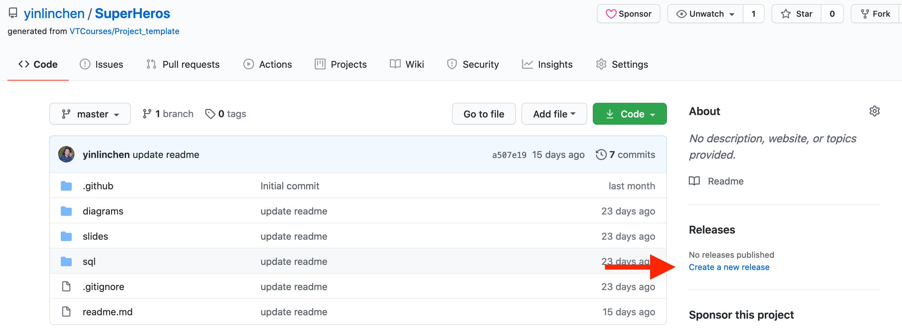
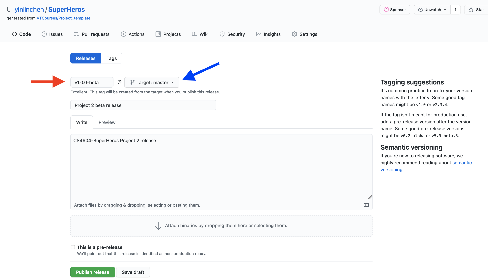
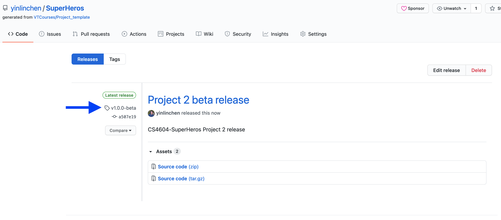

# Github release management

## Creating a release

1. On GitHub, navigate to the main page of the repository.
2. To the right of the list of files, click `Create a new release`.

    

3. Type a version number for your release, e.g., `v1.0.0-beta`. Versions are based on [Git tags](https://git-scm.com/book/en/Git-Basics-Tagging). We recommend naming tags that fit within [semantic versioning](http://semver.org/). Use the drop-down menu to select the branch (e.g., `master` or `main`) that contains the project you want to release.

    

4. Type a title (e.g., `Project 2 beta release`) and description for your release.

5. When you're ready to publicize your release, click `Publish release`. To work on the release later, click Save draft.

6. The release page will look like below. Copy your `release tag` link (e.g., `https://github.com/<your github account>/cs4604-<groupname>/tree/<version-number>`) and submit to the Canvas. 

    

    Note: For more details see [Managing releases in a repository](https://docs.github.com/en/github/administering-a-repository/managing-releases-in-a-repository)