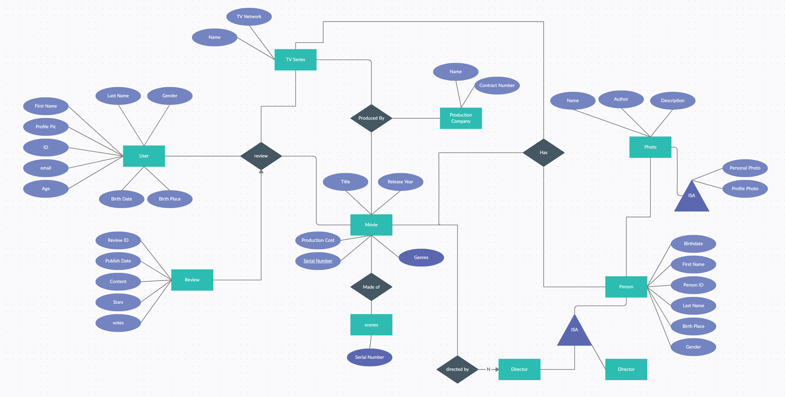

# FilmFanatic

## Project Description
The goal of the class project is to implement a database system application based on the famous [Internet Movie Database (IMDb) dataset](https://www.imdb.com/interfaces/), which is been used widely in database courses and machine learning and data analytics projects. The film industry is a billion-dollar business, the global entertainment market topped $100 billion in 2019. Netflix has more than 167 million subscribers and Disney+ has more than 86.8 million in 14 months. During this pandemic, most people stay at home and watch something. You want to create the next generation of IMDB Website that providing entertainment information to users. 

## Scenarios:
* John recently watched `The Morning Show`, which been nominated for 3 Golden Globes. He likes both lead actor `Mitch Kessler` and lead actress `Alex Levy` in this show. After searching and he found that `Steve Carell` was a lead actor in `The Office`, which dominated the 2020 chart as the most-watched streaming title. `Jennifer Aniston` was a lead actress in `Friends`, which is turning 24 (older than John), but people still can’t stop watching it. Both `Steve Carell` and `Jennifer Aniston` acted in many movies too. He wants to know if they acted in the same movie before. He wonders if there is a Website that can let him search something like that easily.
* John added `The Morning Show` to his watchlist a long time ago, but he hopes he will get notified when the next episode is out. He also wonders if he can be notified if `Steve Carell` or `Jennifer Aniston` has a new film release and tell him where to watch online, he doesn't want to miss any single one!

## The Basic:
* Users can search for a specific movie/TV show.
* Users can edit/update the information of their profiles.
* Users can see a list of films by a specific author.
* User can filter search results by actor(ess), year, publisher, film type, etc.
* User can see search history
* Users can access the trailer of specific movie/TV show.

## The Modeled:

* User
    * Watchlist
* Movies
* TV Series
    * Episodes
* Creators
* Stars
* Ratings
* Reviews
* Streaming (Netflix, Disney+, Amazon Video)

## The Facilities:
* Hot Movies and TV shows in 2020
* List all the oscar nominated movies in 2019
* List 52nd Annual Grammy TV shows awards
* Find `The office` is availble in what streamming platform (Netflix, Peacock, YouTube, Amazon Video, etc)
* Find movies that `Jim` in `The Office` and `Emily Blunt` acted together
* Find moives that won more than 5 Oscars
* List all the movies that `Emma Stone` acted with another Oscar winners
* Will there be a season 2 of the Queen's Gambit?

## Dataset
* [Internet Movie Database (IMDb) dataset](https://www.imdb.com/interfaces/)
* [Kaggle](https://www.kaggle.com/)
    * [Movies on Netflix, Prime Video, Hulu and Disney+](https://www.kaggle.com/ruchi798/movies-on-netflix-prime-video-hulu-and-disney)
    * [TV shows on Netflix, Prime Video, Hulu and Disney+](https://www.kaggle.com/ruchi798/tv-shows-on-netflix-prime-video-hulu-and-disney)
    * [Netflix](https://www.kaggle.com/netflix-inc/netflix-prize-data)

## User data
Assume that your application has the federated Login setup and can get some basic user information from below:
* [Facebook](https://developers.facebook.com/docs/messenger-platform/identity/user-profile/#fields)
* [Twitter](https://developer.twitter.com/en/docs/twitter-api/v1/data-dictionary/object-model/user)
* [Google](https://developers.google.com/identity/sign-in/web/people)
