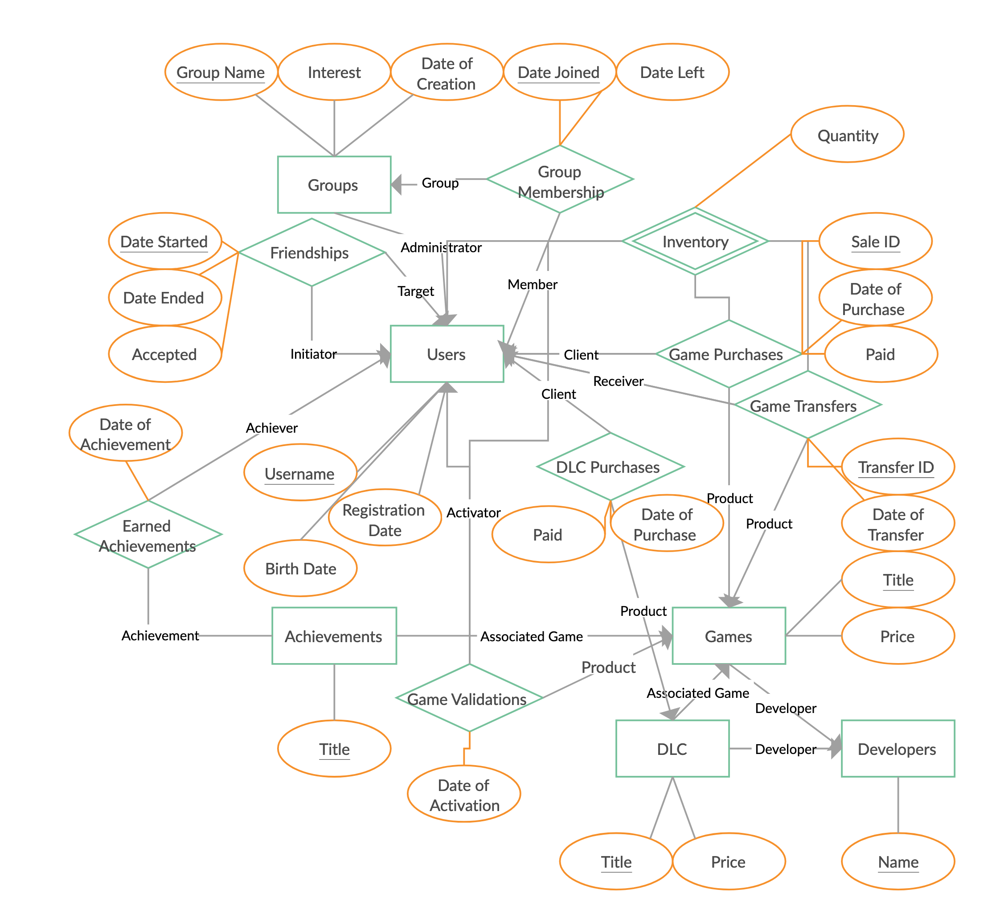

# TooManyGames

## Project Description
The goal of the class project is to implement a database system application based on the [game datasets](Project2.md#dataset). The game industry is a billion-dollar business, the global gaming market will generate $159.3 billion in revenue in 2020. Steam had 120 million monthly users in 2020 and Xbox Live has 90 million monthly users, even EA's digital-download service has more than 39 million registered users. During the pandemic, most people stay at home and play some games. You want to create the next generation of Steam Website that providing entertainment information to users.

## Scenarios:
* Donut owns 1240 games currently, and he continues to purchase new games per month. Even though he doesn't have the time to play all his games, he always intends to buy new games. Sometimes he found a game that looks promising, and then he spent about half a day and finally decided to buy it. After he purchased that game and then it turns out he already has that game a long time ago, he just forgot it. It made him frustrated. 
* He usually finds the game with good user reviews, discount price (85% off), average game completion time around 24hrs, etc. He doesn't like the game that will play more than 20 years, such as `Diablo II`. He like the game only will take him a week with all the achievements are completed.
* He purchase games from multiple platforms (Steam, EPIC, Origin, UPlay, XBOX, Amazon, etc.) Because he has a poor memory, so it happens many times that he purchases the game he already owned, or he played the game he already completed 5 years ago. 
* He always wonders if there is a Website that can help him to manage his games and explore new games with all his strange purchasing preferences on games.

## The Basic:
* Users can search for a specific game.
* Users can edit/update the information of their profiles.
* Users can see a list of games by a specific publisher.
* User can filter search results by year, publisher, genre, etc.
* User can see search history
* User can see game purchase history
* Users can access the trailer of specific games.
* User can search if he/she own this game already.

## The Modeled:

* User
    * Wishlist
    * Owned games
    * Completed games
* Games
    * Platform: PC, XBOX
    * Ratings
    * Reviews
    * Price
    * Achievements
    * Walkthrough
    * PUBLISHER
    * Genres
* Groups
* Friends
* DLC
* Game Price History
* Platform: Steam, Uplay, Epic, Twitch, GOG, Origin
* Streaming (Stadia, Luna, Geforce Now, etc)

## The Facilities:
* List `Overwhelmingly Positive` games developed by `Square Enix` in 2020.
* List all the best seller games in 2019.
* Find `Tomb Raider` is availble in what streamming platform (Stadia, Luna, Geforce Now, etc).
* List `Tomb Raider` Collection by release year.
* List `Adventure` games with at least `very positive` and current sell price is under $10 and I didn't own.
* List all the games that the average completion time is under 4 hours.

## Dataset
* [Steam Dataset](https://steam.internet.byu.edu/) ([paper](https://steam.internet.byu.edu/oneill-condensing-steam.pdf))
* [Kaggle](https://www.kaggle.com/)
    * [Steam Video Games](https://www.kaggle.com/tamber/steam-video-games)
    * [Steam Store Games (Clean dataset)](https://www.kaggle.com/nikdavis/steam-store-games)
    * [Steam games complete dataset](https://www.kaggle.com/trolukovich/steam-games-complete-dataset)
* [Data.world](https://data.world/)
    * [Steam Games Dataset](https://data.world/mhoangvslev/steam-games-dataset)
    * [Steam Game Data](https://data.world/craigkelly/steam-game-data)

## User data
Assume that your application has the federated Login setup and can get some basic user information from below:
* [Facebook](https://developers.facebook.com/docs/messenger-platform/identity/user-profile/#fields)
* [Twitter](https://developer.twitter.com/en/docs/twitter-api/v1/data-dictionary/object-model/user)
* [Google](https://developers.google.com/identity/sign-in/web/people)

