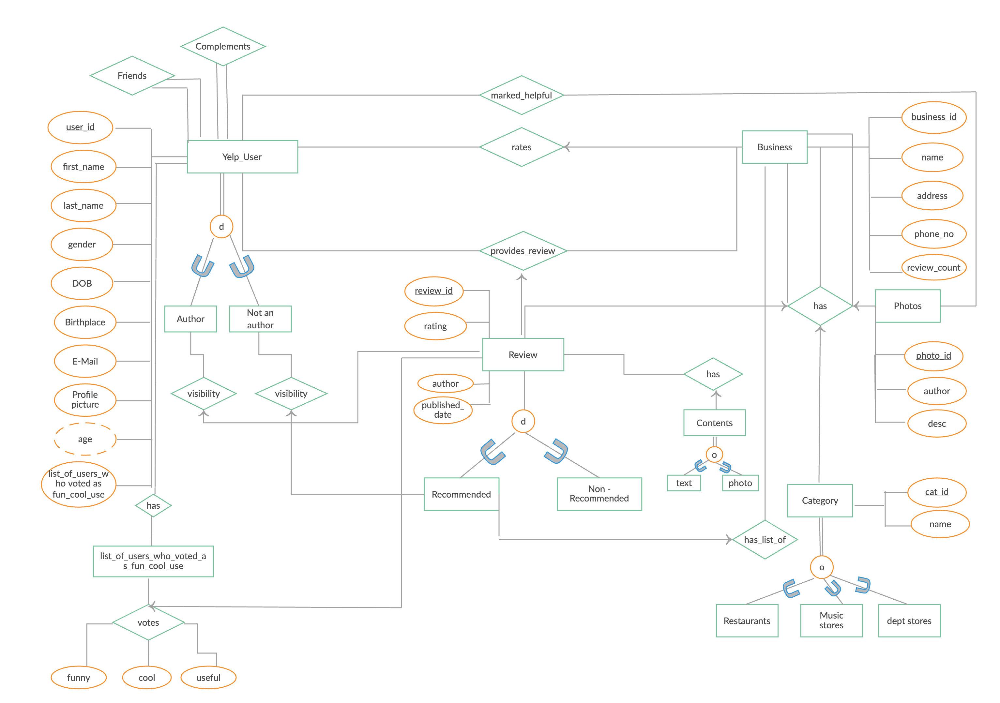

# TravelLover

## Project Description
The goal of the class project is to implement a database system application based on the [travel datasets](Project3.md#dataset). Do you know Americans spent around $930 billion USD on domestic travel in 2018? $101.1 Billion is spent every year in America on summer vacations alone. Yearly U.S. travel and tourism expenditure are around $1.1 Trillion!!! During the pandemic, most people stay at home but we will have travels in near future (Hopely this Summer!). You want to create an awesome travel Website that providing entertainment information to users so they can plan their next travel.

## Scenarios:
* Emma loves to travel, she always dreams about one day she can spend several months in Japan, eating and enjoying life. She needs to make a plan about it and start saving money.
* There are websites like tripadvisor or Google Travel for her to explore new places. However, she usually has trouble finding the restaurant with the food she likes in a new place. She knows to search restaurants in Yelp, but opens two apps is not that convenient.
* She wonders if there is a Website that can help her to plan a 1 - 3 days trip plan for the place she picks. The trip plan not only lists the scenic spots but also restaurant information.

    For example: One day trip in Los Ángeles, CA

    * Discovery Cube: 2500 N Main St, Santa Ana, CA 92705 (ASTC) 10-5pm 
    * Nguyen's Kitchen: 445 S Main St B, Orange, CA 92868
    * Barnes & Noble Town & Country: 791 S Main St Suite 100, Orange, CA 92868
    * Children’s Museum at La Habra: 301 S Euclid St, La Habra, CA 90631 (ASTC) 10-5pm
    * What's Up Japanese Noodles: 512 N State College Blvd, Fullerton, CA 92831
    * Daiso

## The Basic:
* Users can search for a scenic spots.
* Users can edit/update the information of their profiles.
* Users can see a list of scenic spots by a specific city.
* User can filter search results by state, distance ,genre, etc.
* User can see search history.
* User can see his travel history.
* User can "favorite", "want to go", "starred places", etc., places.
* User can search if he/she visited this scenic spot already.

## The Modeled:

* User
    * Wishlist
    * Favorite places
    * Visited places
* Scenic spot
    * Category: Museums, Aquariums, and Zoos
    * Ratings
    * Reviews
    * Price
    * Address
* Restaurant
    * Ratings
    * Reviews
    * Price
    * Address

## The Facilities:
* List my favorited scenic spot I visited in 2019.
* List all the best scenic spots in New York.
* Find top rate Japanese ramen resturants around `the Met`, not `Mets Stadium`.
* List all the scenic spots that the average travel time is under 4 hours from Blacksburg, VA.
* List four stars `Ramen resturants` around `VT Innovation Campus` area and the cost is in the range of $11-$20.
* Show a 3 days plan for ` San Diego`, including restaurant recommendations.

## Dataset
* [GeoNames](http://www.geonames.org/)
    * [US museums](http://www.geonames.org/search.html?q=museum&country=US)
* [Kaggle](https://www.kaggle.com/)
    * [Museums, Aquariums, and Zoos](https://www.kaggle.com/imls/museum-directory)
    * [Yelp Reviews](https://data.world/brianray/yelp-reviews)

## User data
Assume that your application has the federated Login setup and can get some basic user information from below:
* [Facebook](https://developers.facebook.com/docs/messenger-platform/identity/user-profile/#fields)
* [Twitter](https://developer.twitter.com/en/docs/twitter-api/v1/data-dictionary/object-model/user)
* [Google](https://developers.google.com/identity/sign-in/web/people)
